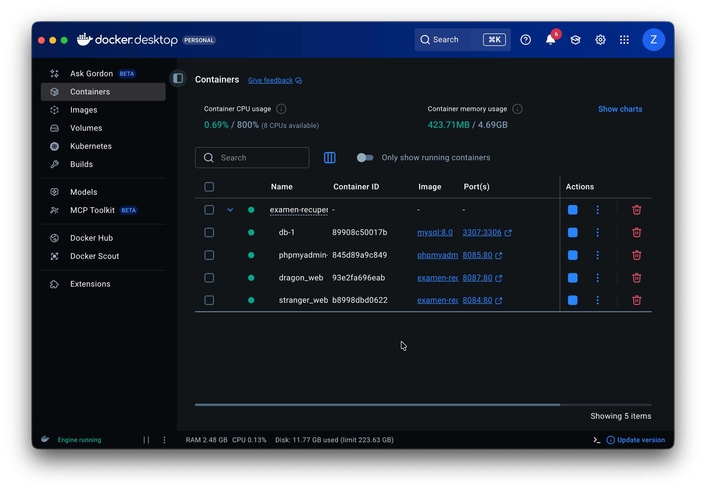
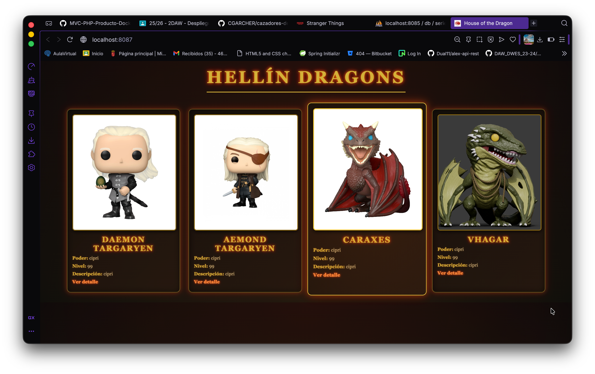
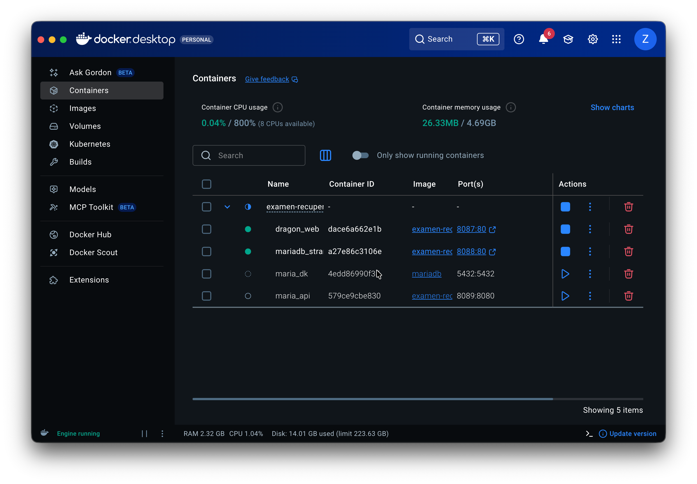
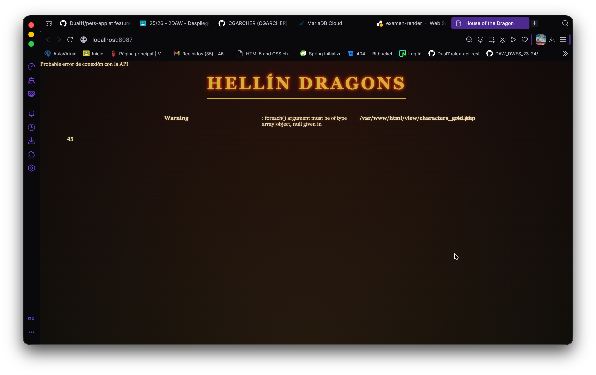

# IMPLEMENTATION.md

## 1. Datos del Alumno

**Nombre completo:** [Wilmer Alexander Tobar Teletor]

---

## 2. Entorno LOCAL

### Descripción
[Breve descripción de qué servicios corren en LOCAL: base de datos MySQL, frontends con hot reload, backend desde IDE, phpMyAdmin]

### Capturas de Ejecución

**⚠️ IMPORTANTE:** Añade todas las capturas que consideres necesarias. Cuanto más completo esté este documento, mejor puntuación obtendrás.

**Docker containers corriendo:**

# Explicacion en caso de no ser preciso
- He creado los docker file para los dos frontend
- Luego he creado el local.properties con la base de datos en local
- Luego he creado a el docker-compose para crear los 4 servicios necesarios
- para cada uno 
- Como hemos visto en la captura los acepta y los muestra, desde el contenendor


**Frontend Stranger Things funcionando:**
 He creado su Dockerfile, en el frontend, para crear su contenedor
 Tambien se puede ver el puerto que se ha utilizado

En esta captura, podemos ver como el contenedor esta funcionando 

**Frontend House of the Dragon funcionando:**



**Backend API funcionando (Postman/navegador):**
Aqui podemos ver como el frontend esta funcionando y el puerto


aqui podemos ver como esta corriendo el contenedor y su puerto

**phpMyAdmin con datos cargados:**


Aqui podemos ver como lo esta corriendo y el puerto

**[Añade aquí más capturas que consideres relevantes]**

### URLs de Acceso
- Frontend Stranger: `http://localhost:8084`
- Frontend Dragon: `http://localhost:8087`
- Backend: `http://localhost:8080`
- phpMyAdmin: `http://localhost:8085`
- MySQL: `localhost:3306`

---

## 3. Entorno PRE

### Descripción
[Breve descripción de qué servicios corren en PRE: backend, frontends en contenedores y base de datos remota MariaDB SkySQL]

### Configuración MariaDB SkySQL

**⚠️ IMPORTANTE:** Incluye capturas del dashboard de MariaDB SkySQL y la configuración de conexión.


He cambiado el pre.propertiens con los datos de skysql, para conectadorlo con mariba db pero no s
se ha conseguido

**Dashboard MariaDB SkySQL:**


**Datos de conexión utilizados:**


**Connection String utilizado:**
```
jdbc:mysql://serverless-us-east4.sysp0000.db2.skysql.com:4043/series?useSSL=true&requireSSL=true
HE USADO ESTO
con el puerto que me dio
jdbc:mysql://serverless-us-central1.sysp0000.db2.skysql.com:4095/series?useSSL=true&requireSSL=true
aunque no 
```

**Tablas y datos en MariaDB SkySQL:**



esta es la unica captura de los contenedores
los servicios si funcionaron, pero la api de hacia maria db se no se mantenia

Las URL
de los servicos para maria db, si se mantenian en el contenedor docker
el unico problema fue a base de datos

### Capturas de Ejecución

**Docker containers corriendo:**


**Frontend Stranger Things funcionando:**


**Frontend House of the Dragon funcionando:**


**API funcionando (Postman/navegador):**


**Logs del backend conectándose a MariaDB:**



# Esta es lo que si hubiera conectado se hubiera visto
ya que la configuracion funciona
**[Añade aquí más capturas que consideres relevantes]**

### URLs de Acceso
- Frontend Stranger: `http://localhost:XXXX`
- Frontend Dragon: `http://localhost:XXXX`
- Backend: `http://localhost:XXXX`

---

## 4. Despliegue en Render


### URLs Públicas de los Servicios

**⚠️ CRÍTICO:** Las URLs públicas y las capturas de configuración de Render son OBLIGATORIAS y muy importantes para la puntuación.

**Backend API:**
- URL: `https://series-backend-XXXXX.onrender.com`

**Frontend Stranger Things:**
- URL: `https://series-frontend-stranger-XXXXX.onrender.com`

**Frontend House of the Dragon:**
- URL: `https://series-frontend-dragon-XXXXX.onrender.com`

### Capturas de Render

**Dashboard con listado de servicios desplegados:**


### Configuración Backend en Render

**Configuración general del servicio backend:**


**Variables de entorno - Backend:**


**Build logs del backend:**


**Logs de ejecución del backend:**


### Configuración Frontend Stranger en Render

**Configuración general del servicio:**


**Variables de entorno - Frontend Stranger:**


**Build logs:**


### Configuración Frontend Dragon en Render

**Configuración general del servicio:**


**Variables de entorno - Frontend Dragon:**


**Build logs:**


### Aplicación Funcionando en Producción

**Frontend Stranger Things (URL pública):**


**Frontend House of the Dragon (URL pública):**


**API funcionando (Postman/navegador - URL pública):**


**Prueba de endpoints con datos reales:**


**[Añade aquí todas las capturas adicionales que consideres relevantes]**

---

## 5. Notas Adicionales

**⚠️ TIP:** Documenta aquí cualquier aspecto relevante de tu implementación, errores encontrados y cómo los solucionaste, o decisiones técnicas importantes.

### Nota 1

**Descripción:**
[Describe algún problema, solución o decisión técnica importante]

**Captura (opcional):**


---

### Nota 2

**Descripción:**
[Describe algún problema, solución o decisión técnica importante]

**Captura (opcional):**


---

### [Añade más notas si es necesario]

---

## 6. Reflexión Personal

**¿Qué te ha parecido el examen? ¿Qué has aprendido? ¿Qué ha sido lo más difícil?**

[Escribe aquí tu reflexión personal sobre el examen]

---

## ⚠️ RECORDATORIO IMPORTANTE

**Cuanto más completo esté este documento, mejor será tu puntuación.**

---